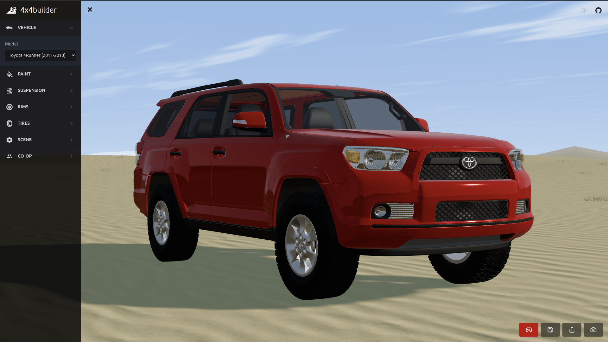

# 4x4Builder.com 🚙

4x4Builder.com is an online 3D application that allows users to construct their ideal 4x4 vehicle in the browser. Whether you're a car enthusiast or just someone who enjoys exploring the world of 3D, 4x4 Builder provides an interactive and immersive experience for building your dream off-road vehicle.

## Tech Stack 🛠️

-   React
-   Three.js
-   React Three Fiber
-   Vite

## Features 🌟

-   Interactive 3D environment
-   Wide selection of vehicles with parts and accessories
-   User-friendly interface for easy customization
-   Real-time rendering and visualization

## Quick Setup ⚙️

To get started with 4x4 Builder, follow these steps:

1. Clone the repository:

`git clone https://github.com/theshanergy/4x4builder.git`

2. Change directory to the project folder:

`cd 4x4builder`

3. Install dependencies:

`npm install`

4. Start the development server:

`npm run dev`

5. Open your browser and navigate to `http://localhost:5173` to start building your 4x4 vehicle!

## Contributing 🤝

Contributions are welcome - If you'd like to contribute, please feel free to submit a pull request or open an issue on GitHub.

## Acknowledgements 🙏

-   [React](https://react.dev/)
-   [Three.js](https://threejs.org/)
-   [React Three Fiber](https://github.com/pmndrs/react-three-fiber)
-   [Vite](https://vitejs.dev/)
