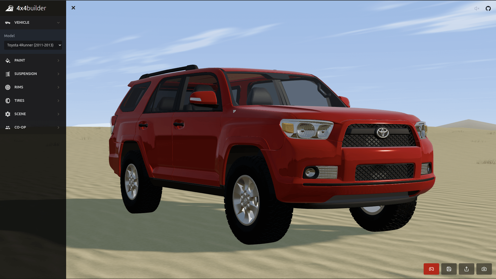

# 4x4 Builder

[](https://4x4builder.com)
[](https://github.com/theshanergy/4x4builder)



**4x4 Builder** is a browser-based 3D off-road vehicle customization and simulation app. Build your dream 4x4, customize every detail from suspension lift to tire size, then drive it through procedurally generated terrain with realistic physics. Features multiplayer support, VR compatibility, and real-time engine audio synthesis.

🌐 **Try it live at [4x4builder.com](https://4x4builder.com)**

---

## ✨ Features

### 🚗 Vehicle Customization
- **Vehicles** — Toyota 4Runner (3rd–5th gen), Land Cruiser (J80, J250), Tacoma, Jeep Wrangler (YJ, JK), Cherokee XJ, Ford Bronco
- **Suspension** — Adjustable lift height from stock to 6"
- **Wheels** — Various rim options from brands like XD Wheels, American Racing, Konig, Cragar, and OEM
- **Tires** — Multiple tire models including BFGoodrich KM2/KM3/AT, Nitto Mud Grappler, Maxxis Trepador
- **Customizable sizing** — Rim diameter (15"–22"), tire diameter (28"–40"), rim width, wheel offset
- **Paint & Finish** — Any body color with adjustable metallic/matte finish
- **Accessories** — Bumpers, rock sliders, roof racks (vehicle-specific)

### 🎮 Driving Simulation
- **Realistic physics** — Powered by Rapier physics engine with suspension, torque curves, and transmission simulation
- **Procedural terrain** — Infinite, dynamically generated terrain with varied elevation and flat regions
- **Dynamic grass** — GPU-instanced grass with wind animation that responds to terrain
- **Engine audio** — Real-time synthesized engine sounds using Web Audio API AudioWorklet
- **Tire tracks** — Persistent tire marks in the terrain
- **Dust particles** — Wheel dust effects when driving

### 🎥 Camera Modes
- **Orbit camera** — Third-person view with smooth follow and terrain collision avoidance
- **First-person** — Driver's seat perspective
- **Auto-rotate** — Showcase mode for screenshots

### 🌐 Multiplayer
- **Real-time multiplayer** — See other players' vehicles and drive together
- **Room-based** — Create or join rooms to play with friends
- **In-game chat** — Communicate with other players
- **Vehicle sync** — Your customizations are visible to others

### 🥽 VR Support
- **WebXR compatible** — Works with VR headsets via `@react-three/xr`
- **Teleport locomotion** — Navigate with VR controllers
- **Immersive experience** — Sit inside your custom vehicle in VR

### 📸 Extras
- **Screenshot export** — Download high-quality PNG images
- **URL sharing** — Vehicle configuration URLs for easy sharing
- **Local storage** — Save multiple vehicle builds
- **Mobile support** — Touch controls with virtual joysticks
- **Responsive UI** — Works on desktop, tablet, and mobile

---

## 🛠️ Tech Stack

| Category | Technologies |
|----------|-------------|
| **Frontend** | [React 19](https://react.dev/), [Zustand](https://github.com/pmndrs/zustand), [Tailwind CSS 4](https://tailwindcss.com/) |
| **3D Engine** | [Three.js](https://threejs.org/), [React Three Fiber](https://github.com/pmndrs/react-three-fiber), [Drei](https://github.com/pmndrs/drei) |
| **Physics** | [Rapier](https://rapier.rs/) via [@react-three/rapier](https://github.com/pmndrs/react-three-rapier) |
| **VR/XR** | [@react-three/xr](https://github.com/pmndrs/xr) |
| **Audio** | Web Audio API with custom AudioWorklet |
| **Build Tool** | [Vite](https://vitejs.dev/) |
| **Multiplayer Server** | Node.js with [ws](https://github.com/websockets/ws) WebSocket library |
| **Shaders** | Custom GLSL for terrain, grass, and sky |

---

## 🚀 Quick Start

### Prerequisites
- [Node.js](https://nodejs.org/) 20.0.0 or higher
- npm or yarn

### Installation

```bash
# Clone the repository
git clone https://github.com/theshanergy/4x4builder.git
cd 4x4builder

# Install dependencies
npm install

# Start the development server
npm run dev
```

Open [https://localhost:5173](https://localhost:5173) in your browser.

> **Note:** The dev server uses HTTPS with a self-signed certificate for WebXR compatibility. You may need to accept the security warning in your browser.

### Build for Production

```bash
npm run build
npm run preview
```

---

## 🌐 Multiplayer Server

The multiplayer server is a separate Node.js application located in the `server/` directory.

```bash
# Navigate to server directory
cd server

# Install server dependencies
npm install

# Start the server (development with auto-reload)
npm run dev

# Or start for production
npm start
```

The server runs on port 8080 by default and provides:
- WebSocket connections for real-time multiplayer
- Health check endpoint: `http://localhost:8080/health`
- Stats endpoint: `http://localhost:8080/stats`

### Environment Variables

| Variable | Description | Default |
|----------|-------------|---------|
| `VITE_MULTIPLAYER_SERVER_URL` | WebSocket server URL for multiplayer | `ws://localhost:8080` |

---

## 📁 Project Structure

```
4x4builder/
├── components/
│   ├── scene/          # 3D scene components (Vehicle, Terrain, Camera, etc.)
│   └── ui/             # React UI components (Editor, Sidebar, Chat, etc.)
├── hooks/              # Custom React hooks (physics, audio, materials)
├── network/            # Multiplayer networking (WebSocket client)
├── public/assets/      # Static assets (3D models, textures, audio)
│   └── models/
│       ├── vehicles/   # Vehicle GLB models by make/model
│       └── wheels/     # Rim and tire GLB models
├── server/             # Multiplayer WebSocket server
├── shaders/            # GLSL vertex and fragment shaders
├── store/              # Zustand state stores
├── utils/              # Utility functions
└── config/				# Configuration
```

---

## 🎮 Controls

### Desktop
| Key | Action |
|-----|--------|
| `↑` / `W` | Accelerate |
| `↓` / `S` | Brake / Reverse |
| `←` / `→` or `A` / `D` | Steer |
| `Shift` | Drift mode |
| `R` | Reset vehicle position |
| `C` | Cycle camera mode |
| `T` | Open chat (multiplayer) |
| `Esc` | Close chat / menus |

### Mobile
- **Left joystick** — Steering
- **Right joystick** — Throttle/brake
- **Drift button** — Enable drift mode
- **Reset button** — Reset vehicle position

### Gamepad
Full controller support with analog steering and triggers.

---

## 🤝 Contributing

Contributions are welcome! Here are some ways you can help:

- 🐛 **Report bugs** — Open an issue with details and reproduction steps
- 💡 **Request features** — Suggest new vehicles, parts, or functionality
- 🔧 **Submit PRs** — Fix bugs or implement new features
- 🎨 **Create 3D models** — Contribute new vehicles, wheels, or accessories
- 📝 **Improve docs** — Help make the documentation clearer

### Development Guidelines
1. Fork the repository
2. Create a feature branch: `git checkout -b feature/my-feature`
3. Make your changes and test thoroughly
4. Submit a pull request with a clear description

---

## 🙏 Acknowledgements

### Libraries & Frameworks
- [React](https://react.dev/) — UI framework
- [Three.js](https://threejs.org/) — 3D graphics library
- [React Three Fiber](https://github.com/pmndrs/react-three-fiber) — React renderer for Three.js
- [Drei](https://github.com/pmndrs/drei) — Useful helpers for R3F
- [Rapier](https://rapier.rs/) — Physics engine
- [Zustand](https://github.com/pmndrs/zustand) — State management
- [Vite](https://vitejs.dev/) — Build tool
- [Tailwind CSS](https://tailwindcss.com/) — Styling

---

## 📊 Stats


